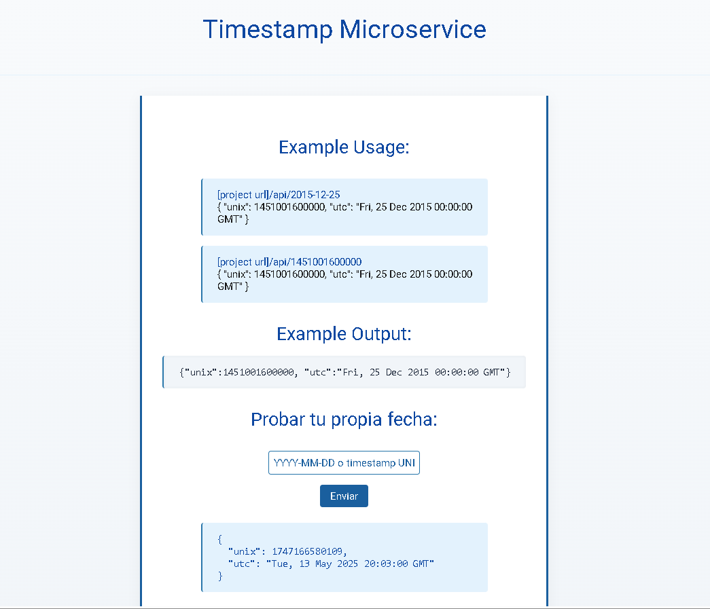

# Timestamp Microservice

Este es un microservicio de timestamp construido con Node.js y Express, siguiendo el proyecto de APIs y Microservicios de freeCodeCamp.

## Descripción

El microservicio expone una API que puede recibir una fecha en formato UNIX o en formato de fecha estándar y devuelve un objeto JSON con la fecha en formato UNIX y UTC. Si no se proporciona ninguna fecha, devuelve la fecha y hora actual.

## Estructura del proyecto

```
├── index.js           # Inicializa el servidor
├── myapp.js           # Configuración de la aplicación Express y rutas
├── package.json       # Dependencias y scripts
├── public/            # Archivos estáticos (CSS)
│   └── style.css
├── views/             # Archivos de vistas (HTML)
│   └── index.html
└── README.md          # Este archivo
```

## Instalación

1. Clona este repositorio o descarga los archivos.
2. Instala las dependencias:
   ```bash
   npm install
   ```
3. Inicia el servidor:
   ```bash
   node index.js
   ```
4. Abre tu navegador en `http://localhost:3000`.

## Endpoints de la API

- `GET /api/hello`
  - Respuesta: `{ "greeting": "hello API" }`

- `GET /api/:date`
  - `:date` puede ser una fecha en formato `YYYY-MM-DD` o un timestamp UNIX (milisegundos).
  - Ejemplo: `/api/2015-12-25` o `/api/1451001600000`
  - Respuesta exitosa:
    ```json
    {
      "unix": 1451001600000,
      "utc": "Fri, 25 Dec 2015 00:00:00 GMT"
    }
    ```
  - Respuesta de error:
    ```json
    { "error": "Invalid Date" }
    ```

## Screenshot



## Notas
- Los archivos estáticos (como el CSS) se sirven desde la carpeta `public`.
- El archivo principal de configuración de rutas es `myapp.js`.

## Créditos
Proyecto basado en el curriculum de [freeCodeCamp.org](https://www.freecodecamp.org/).
